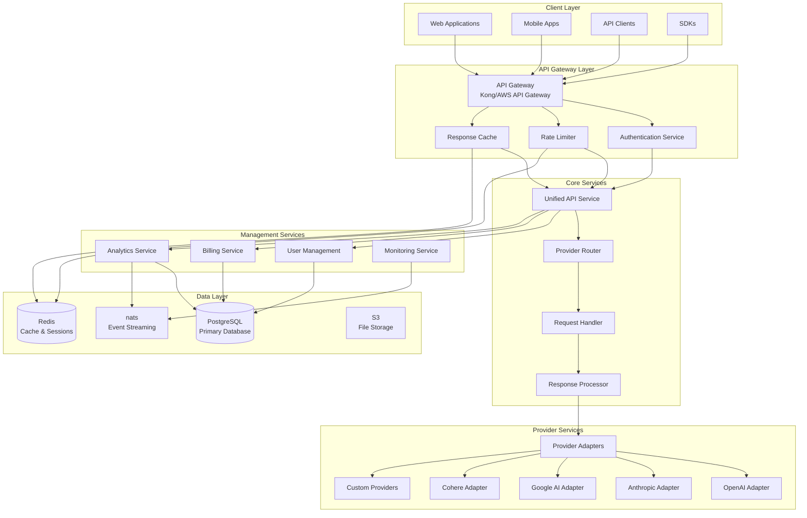

# AI Aggregator Service Architecture - Technical Blueprint

## 1. High-Level System Overview

### System Architecture Diagram



### Core Design Principles

1. **Microservices Architecture**: Each service has a single responsibility
2. **Provider Abstraction**: Unified interface regardless of underlying provider
3. **Scalability**: Horizontal scaling for all services
4. **Resilience**: Circuit breakers, retries, and fallback mechanisms
5. **Observability**: Comprehensive logging, metrics, and tracing
6. **Security**: Zero-trust architecture with proper authentication/authorization

## 2. Microservices Architecture

### Service Boundaries

| Service | Responsibility | Technology Stack |
|---------|----------------|------------------|
| **API Gateway** | Request routing, rate limiting, caching | Kong/AWS API Gateway |
| **Auth Service** | Authentication, authorization, API key management | Node.js/Express |
| **Unified API** | Request transformation, response normalization | Node.js/Express |
| **Provider Router** | Provider selection, load balancing | Node.js |
| **User Management** | User/organization management | Node.js |
| **Billing Service** | Usage tracking, billing, invoicing | Node.js |
| **Analytics Service** | Usage analytics, reporting | Python/FastAPI |
| **Monitoring Service** | Health checks, alerting | Go |
| **Provider Adapters** | Provider-specific integrations | Node.js/Python |

### Communication Patterns

- **Synchronous**: REST APIs for real-time requests
- **Asynchronous**: nats for event streaming
- **Caching**: Redis for session and response caching
- **Database**: PostgreSQL for persistent storage

## 3. Database Schema Design (PostgreSQL)

### Core Tables

#### Users & Organizations

```sql
-- Organizations
CREATE TABLE organizations (
    id UUID PRIMARY KEY DEFAULT gen_random_uuid(),
    name VARCHAR(255) NOT NULL,
    slug VARCHAR(100) UNIQUE NOT NULL,
    plan_type VARCHAR(50) NOT NULL DEFAULT 'free',
    billing_email VARCHAR(255),
    created_at TIMESTAMP WITH TIME ZONE DEFAULT NOW(),
    updated_at TIMESTAMP WITH TIME ZONE DEFAULT NOW(),
    metadata JSONB DEFAULT '{}',
    is_active BOOLEAN DEFAULT TRUE
);

-- Users
CREATE TABLE users (
    id UUID PRIMARY KEY DEFAULT gen_random_uuid(),
    email VARCHAR(255) UNIQUE NOT NULL,
    full_name VARCHAR(255),
    password_hash VARCHAR(255),
    organization_id UUID REFERENCES organizations(id),
    role VARCHAR(50) NOT NULL DEFAULT 'member',
    created_at TIMESTAMP WITH TIME ZONE DEFAULT NOW(),
    updated_at TIMESTAMP WITH TIME ZONE DEFAULT NOW(),
    last_login TIMESTAMP WITH TIME ZONE,
    is_active BOOLEAN DEFAULT TRUE,
    email_verified BOOLEAN DEFAULT FALSE
);

-- API Keys
CREATE TABLE api_keys (
    id UUID PRIMARY KEY DEFAULT gen_random_uuid(),
    user_id UUID REFERENCES users(id),
    organization_id UUID REFERENCES organizations(id),
    key_hash VARCHAR(255) UNIQUE NOT NULL,
    name VARCHAR(255),
    permissions JSONB DEFAULT '[]',
    rate_limit_per_minute INTEGER DEFAULT 60,
    rate_limit_per_hour INTEGER DEFAULT 1000,
    rate_limit_per_day INTEGER DEFAULT 10000,
    created_at TIMESTAMP WITH TIME ZONE DEFAULT NOW(),
    expires_at TIMESTAMP WITH TIME ZONE,
    last_used TIMESTAMP WITH TIME ZONE,
    is_active BOOLEAN DEFAULT TRUE
);
```

#### Provider Management

```sql
-- AI Providers
CREATE TABLE providers (
    id UUID PRIMARY KEY DEFAULT gen_random_uuid(),
    name VARCHAR(255) NOT NULL,
    slug VARCHAR(100) UNIQUE NOT NULL,
    base_url VARCHAR(500) NOT NULL,
    api_key_required BOOLEAN DEFAULT TRUE,
    is_active BOOLEAN DEFAULT TRUE,
    created_at TIMESTAMP WITH TIME ZONE DEFAULT NOW(),
    updated_at TIMESTAMP WITH TIME ZONE DEFAULT NOW(),
    config JSONB DEFAULT '{}'
);

-- AI Models
CREATE TABLE models (
    id UUID PRIMARY KEY DEFAULT gen_random_uuid(),
    provider_id UUID REFERENCES providers(id),
    name VARCHAR(255) NOT NULL,
    slug VARCHAR(100) NOT NULL,
    model_type VARCHAR(50) NOT NULL, -- 'chat', 'completion', 'embedding', 'image'
    max_tokens INTEGER,
    pricing_per_1k_tokens DECIMAL(10,6),
    pricing_per_image DECIMAL(10,6),
    context_window INTEGER,
    is_active BOOLEAN DEFAULT TRUE,
    created_at TIMESTAMP WITH TIME ZONE DEFAULT NOW(),
    updated_at TIMESTAMP WITH TIME ZONE DEFAULT NOW(),
    UNIQUE(provider_id, slug)
);

-- Provider Endpoints
CREATE TABLE provider_endpoints (
    id UUID PRIMARY KEY DEFAULT gen_random_uuid(),
    provider_id UUID REFERENCES providers(id),
    model_id UUID REFERENCES models(id),
    endpoint_url VARCHAR(500) NOT NULL,
    http_method VARCHAR(10) NOT NULL DEFAULT 'POST',
    request_transform JSONB DEFAULT '{}',
    response_transform JSONB DEFAULT '{}',
    timeout_seconds INTEGER DEFAULT 30,
    retry_count INTEGER DEFAULT 3,
    is_active BOOLEAN DEFAULT TRUE
);
```

#### Request/Response Logging

```sql
-- API Requests
CREATE TABLE api_requests (
    id UUID PRIMARY KEY DEFAULT gen_random_uuid(),
    api_key_id UUID REFERENCES api_keys(id),
    user_id UUID REFERENCES users(id),
    organization_id UUID REFERENCES organizations(id),
    provider_id UUID REFERENCES providers(id),
    model_id UUID REFERENCES models(id),
    request_id VARCHAR(255) UNIQUE NOT NULL,
    endpoint_path VARCHAR(500),
    method VARCHAR(10),
    request_body JSONB,
    request_headers JSONB,
    ip_address INET,
    user_agent TEXT,
    created_at TIMESTAMP WITH TIME ZONE DEFAULT NOW(),
    processing_started_at TIMESTAMP WITH TIME ZONE,
    processing_completed_at TIMESTAMP WITH TIME ZONE
);

-- API Responses
CREATE TABLE api_responses (
    id UUID PRIMARY KEY DEFAULT gen_random_uuid(),
    request_id UUID REFERENCES api_requests(id),
    status_code INTEGER,
    response_body JSONB,
    response_headers JSONB,
    error_message TEXT,
    tokens_used INTEGER,
    cost DECIMAL(10,6),
    latency_ms INTEGER,
    provider_response_time_ms INTEGER,
    created_at TIMESTAMP WITH TIME ZONE DEFAULT NOW()
);

-- Request Analytics
CREATE TABLE request_analytics (
    id UUID PRIMARY KEY DEFAULT gen_random_uuid(),
    organization_id UUID REFERENCES organizations(id),
    user_id UUID REFERENCES users(id),
    provider_id UUID REFERENCES providers(id),
    model_id UUID REFERENCES models(id),
    date DATE NOT NULL,
    request_count INTEGER DEFAULT 0,
    token_count INTEGER DEFAULT 0,
    total_cost DECIMAL(10,6) DEFAULT 0,
    average_latency_ms INTEGER DEFAULT 0,
    error_count INTEGER DEFAULT 0,
    created_at TIMESTAMP WITH TIME ZONE DEFAULT NOW(),
    updated_at TIMESTAMP WITH TIME ZONE DEFAULT NOW(),
    UNIQUE(organization_id, user_id, provider_id, model_id, date)
);
```

#### Rate Limiting & Quotas

```sql
-- Rate Limit Rules
CREATE TABLE rate_limit_rules (
    id UUID PRIMARY KEY DEFAULT gen_random_uuid(),
    organization_id UUID REFERENCES organizations(id),
    user_id UUID REFERENCES users(id),
    api_key_id UUID REFERENCES api_keys(id),
    model_id UUID REFERENCES models(id),
    limit_type VARCHAR(50) NOT NULL, -- 'requests', 'tokens', 'cost'
    limit_value INTEGER NOT NULL,
    limit_period VARCHAR(20) NOT NULL, -- 'minute', 'hour', 'day', 'month'
    created_at TIMESTAMP WITH TIME ZONE DEFAULT NOW(),
    updated_at TIMESTAMP WITH TIME ZONE DEFAULT NOW()
);

-- Usage Quotas
CREATE TABLE usage_quotas (
    id UUID PRIMARY KEY DEFAULT gen_random_uuid(),
    organization_id UUID REFERENCES organizations(id),
    quota_type VARCHAR(50) NOT NULL, -- 'requests', 'tokens', 'cost'
    quota_limit BIGINT NOT NULL,
    quota_period VARCHAR(20) NOT NULL, -- 'daily', 'monthly', 'custom'
    current_usage BIGINT DEFAULT 0,
    reset_date DATE,
    created_at TIMESTAMP WITH TIME ZONE DEFAULT NOW(),
    updated_at TIMESTAMP WITH TIME ZONE DEFAULT NOW()
);

-- Rate Limit Tracking
CREATE TABLE rate_limit_tracking (
    id UUID PRIMARY KEY DEFAULT gen_random_uuid(),
    api_key_id UUID REFERENCES api_keys(id),
    limit_type VARCHAR(50) NOT NULL,
    limit_period VARCHAR(20) NOT NULL,
    current_count INTEGER DEFAULT 0,
    window_start TIMESTAMP WITH TIME ZONE NOT NULL,
    window_end TIMESTAMP WITH TIME ZONE NOT NULL,
    created_at TIMESTAMP WITH TIME ZONE DEFAULT NOW(),
    updated_at TIMESTAMP WITH TIME ZONE DEFAULT NOW()
);
```

#### Billing & Usage

```sql
-- Billing Plans
CREATE TABLE billing_plans (
    id UUID PRIMARY KEY DEFAULT gen_random_uuid(),
    name VARCHAR(255) NOT NULL,
    description TEXT,
    base_price DECIMAL(10,2),
    included_tokens INTEGER,
    included_requests INTEGER,
    overage_rate_per_1k_tokens DECIMAL(10,6),
    features JSONB DEFAULT '[]',
    is_active BOOLEAN DEFAULT TRUE,
    created_at TIMESTAMP WITH TIME ZONE DEFAULT NOW()
);

-- Subscriptions
CREATE TABLE subscriptions (
    id UUID PRIMARY KEY DEFAULT gen_random_uuid(),
    organization_id UUID REFERENCES organizations(id),
    plan_id UUID REFERENCES billing_plans(id),
    status VARCHAR(50) NOT NULL DEFAULT 'active',
    current_period_start DATE,
    current_period_end DATE,
    created_at TIMESTAMP WITH TIME ZONE DEFAULT NOW(),
    updated_at TIMESTAMP WITH TIME ZONE DEFAULT NOW()
);

-- Usage Billing
CREATE TABLE usage_billing (
    id UUID PRIMARY KEY DEFAULT gen_random_uuid(),
    organization_id UUID REFERENCES organizations(id),
    billing_period_start DATE NOT NULL,
    billing_period_end DATE NOT NULL,
    total_requests INTEGER DEFAULT 0,
    total_tokens INTEGER DEFAULT 0,
    total_cost DECIMAL(10,6) DEFAULT 0,
    status VARCHAR(50) NOT NULL DEFAULT 'pending',
    invoice_id VARCHAR(255),
    created_at TIMESTAMP WITH TIME ZONE DEFAULT NOW(),
    updated_at TIMESTAMP WITH TIME ZONE DEFAULT NOW()
);
```

### Indexes & Performance

```sql
-- Performance indexes
CREATE INDEX idx_api_requests_api_key_id ON api_requests(api_key_id);
CREATE INDEX idx_api_requests_user_id ON api_requests(user_id);
CREATE INDEX idx_api_requests_organization_id ON api_requests(organization_id);
CREATE INDEX idx_api_requests_created_at ON api_requests(created_at);
CREATE INDEX idx_api_requests_request_id ON api_requests(request_id);

CREATE INDEX idx_api_responses_request_id ON api_responses(request_id);
CREATE INDEX idx_api_responses_status_code ON api_responses(status_code);

CREATE INDEX idx_request_analytics_org_date ON request_analytics(organization_id, date);
CREATE INDEX idx_request_analytics_user_date ON request_analytics(user_id, date);

CREATE INDEX idx_rate_limit_tracking_api_key ON rate_limit_tracking(api_key_id);
CREATE INDEX idx_rate_limit_tracking_window ON rate_limit_tracking(window_start, window_end);
```

## 4. API Design - Unified Interface

### RESTful API Endpoints

#### Authentication
```
POST   /v1/auth/login
POST   /v1/auth/logout
POST   /v1/auth/refresh
GET    /v1/auth/me
```

#### API Keys
```
GET    /v1/api-keys
POST   /v1/api-keys
GET    /v1/api-keys/:id
PUT    /v1/api-keys/:id
DELETE /v1/api-keys/:id
```

#### Models
```
GET    /v1/models
GET    /v1/models/:id
GET    /v1/providers
```

#### Chat Completions
```
POST   /v1/chat/completions
```

#### Text Completions
```
POST   /v1/completions
```

#### Embeddings
```
POST   /v1/embeddings
```

#### Images
```
POST   /v1/images/generations
POST   /v1/images/edits
POST   /v1/images/variations
```

#### Usage & Analytics
```
GET    /v1/usage
GET    /v1/analytics/requests
GET    /v1/analytics/tokens
GET    /v1/analytics/cost
```

### Unified Request/Response Format

#### Chat Completions Request
```json
{
  "model": "gpt-4",
  "messages": [
    {
      "role": "user",
      "content": "Hello, how are you?"
    }
  ],
  "max_tokens": 100,
  "temperature": 0.7,
  "stream": false,
  "metadata": {
    "user_id": "custom_user_id",
    "session_id": "session_123"
  }
}
```

#### Chat Completions Response
```json
{
  "id": "chatcmpl-123",
  "object": "chat.completion",
  "created": 1677858242,
  "model": "gpt-4",
  "choices": [
    {
      "index": 0,
      "message": {
        "role": "assistant",
        "content": "I'm doing well, thank you for asking!"
      },
      "finish_reason": "stop"
    }
  ],
  "usage": {
    "prompt_tokens": 10,
    "completion_tokens": 10,
    "total_tokens": 20
  },
  "provider": {
    "name": "openai",
    "model": "gpt-4",
    "latency_ms": 245
  }
}
```

### Provider Abstraction Layer

#### Provider Adapter Interface
```typescript
interface ProviderAdapter {
  name: string;
  supportedModels: string[];
  
  transformRequest(request: UnifiedRequest): ProviderRequest;
  transformResponse(response: ProviderResponse): UnifiedResponse;
  handleError(error: any): UnifiedError;
  calculateCost(request: UnifiedRequest, response: UnifiedResponse): number;
}
```

## 5. Authentication & Authorization Strategy

### Multi-Tenant Architecture

#### Authentication Flow
1. **API Key Authentication**: Primary method for API access
2. **JWT Tokens**: For dashboard/console access
3. **OAuth 2.0**: For third-party integrations

#### Authorization Model
- **RBAC (Role-Based Access Control)**
  - Organization Admin
  - Organization Member
  - API Key (scoped permissions)
- **Resource-Level Permissions**
  - Model access restrictions
  - Rate limit overrides
  - Usage quotas

### Security Implementation

#### API Key Security
- **Key Format**: `sk_live_1234567890abcdef` (prefix + random)
- **Storage**: Hashed in database (bcrypt)
- **Rotation**: Automatic expiration and renewal
- **Scope**: Per-organization with granular permissions

#### JWT Token Structure
```json
{
  "sub": "user_uuid",
  "org": "organization_uuid",
  "role": "admin",
  "permissions": ["read:models", "write:api-keys"],
  "exp": 1677858242,
  "iat": 1677854642
}
```

## 6. Rate Limiting & Quota Management

### Rate Limiting Strategy

#### Multi-Level Rate Limiting
1. **Global Limits**: Per API key
2. **User Limits**: Per user
3. **Organization Limits**: Per organization
4. **Model Limits**: Per model/provider

#### Rate Limit Headers
```
X-RateLimit-Limit: 1000
X-RateLimit-Remaining: 999
X-RateLimit-Reset: 1677858242
X-RateLimit-Window: 3600
```

### Quota Management

#### Quota Types
- **Request Quotas**: Number of API calls
- **Token Quotas**: Total tokens processed
- **Cost Quotas**: Total cost in USD

#### Quota Tracking
- **Real-time**: Redis counters with TTL
- **Daily Reset**: Automatic at UTC midnight
- **Custom Periods**: Configurable billing cycles

## 7. Caching Strategy

### Multi-Level Caching

#### 1. Response Cache (Redis)
- **TTL**: 5-30 minutes based on content
- **Key Format**: `response:{model}:{hash(request)}`
- **Invalidation**: Model updates, provider changes

#### 2. Model Metadata Cache
- **TTL**: 1 hour
- **Content**: Model capabilities, pricing, limits

#### 3. Authentication Cache
- **TTL**: 15 minutes
- **Content**: API key validation, user permissions

#### 4. CDN Cache
- **Static Content**: Model documentation, SDK files
- **TTL**: 24 hours with cache busting

### Cache Invalidation Strategy
- **Event-Driven**: nats events for cache updates
- **Time-Based**: Automatic expiration
- **Manual**: Admin API for forced invalidation

## 8. Monitoring & Observability

### Metrics Collection

#### Application Metrics
- **Request Rate**: Requests per second
- **Response Time**: P50, P95, P99 latencies
- **Error Rate**: 4xx, 5xx errors
- **Provider Health**: Success rates per provider

#### Business Metrics
- **Usage**: Tokens, requests, cost per organization
- **Revenue**: Daily, monthly revenue
- **Active Users**: DAU, MAU
- **Model Adoption**: Usage per model

### Logging Strategy

#### Structured Logging
```json
{
  "timestamp": "2023-03-01T12:00:00Z",
  "level": "info",
  "service": "unified-api",
  "trace_id": "abc123",
  "user_id": "user_uuid",
  "request_id": "req_123",
  "provider": "openai",
  "model": "gpt-4",
  "tokens": 150,
  "cost": 0.003,
  "latency_ms": 245
}
```

### Alerting Rules

#### Critical Alerts
- Provider downtime (>5% error rate)
- High latency (>5s P95)
- Rate limit exceeded (>90% quota)
- Database connection issues

#### Warning Alerts
- Elevated error rates (>1%)
- Slow queries (>1s)
- Cache hit ratio <80%

### Distributed Tracing
- **OpenTelemetry**: End-to-end request tracing
- **Jaeger**: Trace visualization
- **Correlation IDs**: Request tracking across services

## 9. Security Considerations

### Data Security

#### Encryption
- **In Transit**: TLS 1.3 for all communications
- **At Rest**: AES-256 for database encryption
- **API Keys**: bcrypt hashing with salt

#### Data Retention
- **Request Logs**: 90 days (PII redacted)
- **Analytics**: 2 years (aggregated)
- **Billing**: 7 years (compliance)

### API Security

#### Input Validation
- **Request Size**: 10MB limit
- **Rate Limiting**: Per IP and API key
- **SQL Injection**: Parameterized queries
- **XSS Prevention**: Content-Type validation

#### Provider Security
- **API Key Rotation**: Monthly automatic rotation
- **Secret Management**: AWS Secrets Manager
- **Network Security**: VPC isolation

### Compliance

#### Standards
- **SOC 2 Type II**: Security controls
- **GDPR**: Data protection
- **CCPA**: Privacy rights
- **PCI DSS**: Payment processing

#### Audit Trail
- **User Actions**: All API key operations
- **System Changes**: Configuration updates
- **Access Logs**: Failed authentication attempts

## 10. Deployment & Scaling

### Infrastructure Architecture

#### Cloud Provider
- **Primary**: AWS (multi-region)
- **Backup**: GCP (disaster recovery)

#### Container Orchestration
- **Kubernetes**: EKS clusters
- **Service Mesh**: Istio for traffic management
- **Auto-scaling**: HPA based on CPU/memory

### Scaling Strategy

#### Horizontal Scaling
- **Stateless Services**: Easy horizontal scaling
- **Database**: Read replicas, sharding by organization
- **Cache**: Redis cluster with partitioning
- **Queue**: nats cluster with topic partitioning

#### Vertical Scaling
- **Database**: Instance size based on load
- **Cache**: Memory optimization for hot data
- **Compute**: CPU/memory optimization per service

### High Availability

#### Multi-Region Deployment
- **Primary Region**: us-east-1 (N. Virginia)
- **Secondary Region**: us-west-2 (Oregon)
- **Failover**: Automatic DNS failover (Route 53)

#### Disaster Recovery
- **RTO**: 15 minutes
- **RPO**: 1 minute (with nats streaming)
- **Backup Strategy**: Daily snapshots, cross-region replication

### Resource Allocation

#### Service Tiers
| Service | CPU | Memory | Replicas | Auto-scaling |
|---------|-----|--------|----------|--------------|
| API Gateway | 2 cores | 4GB | 3-10 | CPU >70% |
| Unified API | 4 cores | 8GB | 5-20 | Request rate |
| Auth Service | 2 cores | 4GB | 3-5 | CPU >70% |
| Provider Router | 2 cores | 4GB | 5-15 | Request rate |
| Database | 8 cores | 32GB | 2 (primary+replica) | Storage IOPS |
| Redis | 4 cores | 16GB | 3 (cluster) | Memory usage |

## 11. Technical Implementation Blueprint

### Development Environment

#### Local Development
```yaml
# docker-compose.yml
version: '3.8'
services:
  postgres:
    image: postgres:15
    environment:
      POSTGRES_DB: ai_aggregator
      POSTGRES_USER: dev
      POSTGRES_PASSWORD: dev
    ports:
      - "5432:5432"
  
  redis:
    image: redis:7-alpine
    ports:
      - "6379:6379"
  
  nats:
    image: confluentinc/cp-nats:latest
    environment:
      nats_ZOOKEEPER_CONNECT: zookeeper:2181
      nats_ADVERTISED_LISTENERS: PLAINTEXT://localhost:9092
    ports:
      - "9092:9092"
  
  api-gateway:
    build: ./services/api-gateway
    ports:
      - "8080:8080"
    depends_on:
      - postgres
      - redis
```

### CI/CD Pipeline

#### GitHub Actions Workflow
```yaml
name: Deploy AI Aggregator

on:
  push:
    branches: [main, develop]

jobs:
  test:
    runs-on: ubuntu-latest
    steps:
      - uses: actions/checkout@v3
      - uses: actions/setup-node@v3
      - run: npm test
      - run: npm run test:integration

  build:
    needs: test
    runs-on: ubuntu-latest
    steps:
      - uses: actions/checkout@v3
      - uses: aws-actions/configure-aws-credentials@v2
      - run: |
          docker build -t $ECR_REGISTRY/ai-aggregator:$GITHUB_SHA .
          docker push $ECR_REGISTRY/ai-aggregator:$GITHUB_SHA

  deploy:
    needs: build
    runs-on: ubuntu-latest
    steps:
      - uses: aws-actions/configure-aws-credentials@v2
      - run: |
          kubectl set image deployment/api-gateway api-gateway=$ECR_REGISTRY/ai-aggregator:$GITHUB_SHA
          kubectl rollout status deployment/api-gateway
```

### Testing Strategy

#### Test Types
- **Unit Tests**: 80% code coverage minimum
- **Integration Tests**: API endpoints, database
- **Contract Tests**: Provider API compatibility
- **Load Tests**: 10,000 RPS capacity
- **Chaos Tests**: Service failure scenarios

#### Test Environments
- **Development**: Local Docker
- **Staging**: Kubernetes cluster (mini-production)
- **Production**: Full-scale deployment

### Monitoring Dashboard

#### Key Metrics to Track
```yaml
dashboards:
  - name: "System Health"
    metrics:
      - api_request_rate
      - api_error_rate
      - provider_availability
      - database_connections
  
  - name: "Business Metrics"
    metrics:
      - daily_active_users
      - revenue_per_day
      - tokens_processed
      - cost_per_user
  
  - name: "Provider Performance"
    metrics:
      - provider_latency
      - provider_success_rate
      - provider_cost
      - provider_error_types
```

### Migration Strategy

#### Phase 1: Foundation (Weeks 1-4)
- Set up infrastructure
- Implement core services
- Database schema deployment
- Basic authentication

#### Phase 2: Provider Integration (Weeks 5-8)
- OpenAI integration
- Anthropic integration
- Response normalization
- Error handling

#### Phase 3: Advanced Features (Weeks 9-12)
- Rate limiting
- Caching layer
- Analytics
- Billing integration

#### Phase 4: Production Ready (Weeks 13-16)
- Monitoring setup
- Security hardening
- Performance optimization
- Documentation

### Cost Estimation

#### Monthly Infrastructure Costs (AWS)
| Service | Size | Cost/Month |
|---------|------|------------|
| EKS Cluster | 3 nodes x m5.large | $150 |
| RDS PostgreSQL | db.r5.large | $200 |
| ElastiCache Redis | cache.r5.large | $150 |
| ALB | 1 load balancer | $25 |
| Data Transfer | 1TB | $90 |
| S3 Storage | 100GB | $5 |
| CloudWatch | Standard | $50 |
| **Total** | | **$670/month** |

#### Scaling Costs
- **Per 1000 daily active users**: +$200/month
- **Per 1M requests/day**: +$150/month
- **High availability (multi-region)**: 2x base cost

### Security Checklist

#### Pre-Production Security Review
- [ ] API key rotation implemented
- [ ] Rate limiting tested
- [ ] Input validation complete
- [ ] SQL injection prevention
- [ ] XSS prevention
- [ ] HTTPS enforcement
- [ ] Security headers configured
- [ ] Secrets management
- [ ] Network security groups
- [ ] IAM roles and policies
- [ ] Encryption at rest
- [ ] Encryption in transit
- [ ] Audit logging
- [ ] Vulnerability scanning
- [ ] Penetration testing

### Documentation Structure

#### Technical Documentation
```
docs/
├── api/
│   ├── openapi.yaml
│   ├── authentication.md
│   └── rate-limits.md
├── deployment/
│   ├── kubernetes.md
│   ├── monitoring.md
│   └── scaling.md
├── providers/
│   ├── openai.md
│   ├── anthropic.md
│   └── adding-new-provider.md
└── troubleshooting/
    ├── common-issues.md
    └── debugging-guide.md
```

### Support & Maintenance

#### Operational Runbooks
- Database backup/restore
- Provider outage response
- Rate limit troubleshooting
- Performance optimization
- Security incident response

#### SLA Targets
- **API Uptime**: 99.9%
- **Response Time**: <500ms P95
- **Error Rate**: <0.1%
- **Support Response**: <4 hours

---

## Summary

This comprehensive architecture provides a production-ready blueprint for building an AI aggregator service similar to OpenRouter. The design emphasizes:

1. **Scalability**: Microservices architecture with horizontal scaling
2. **Reliability**: Multi-region deployment with disaster recovery
3. **Security**: Zero-trust architecture with comprehensive security controls
4. **Performance**: Multi-level caching and optimized data access
5. **Observability**: Full monitoring, logging, and alerting
6. **Maintainability**: Clear service boundaries and documentation

The implementation can be approached incrementally, starting with core functionality and adding advanced features as the service grows. The modular design allows for easy addition of new AI providers and features without disrupting existing functionality.